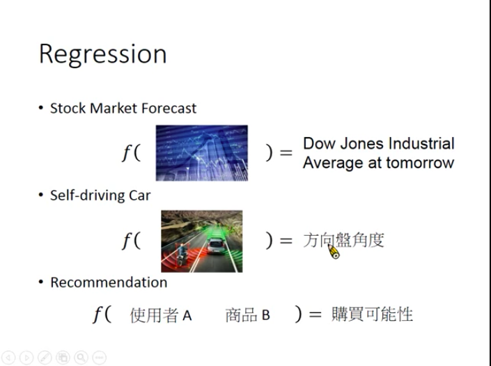
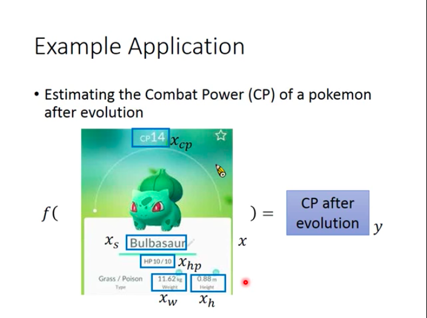
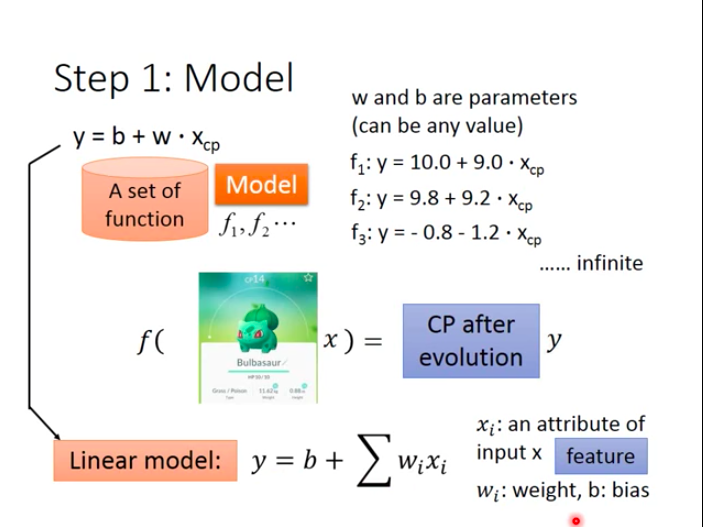
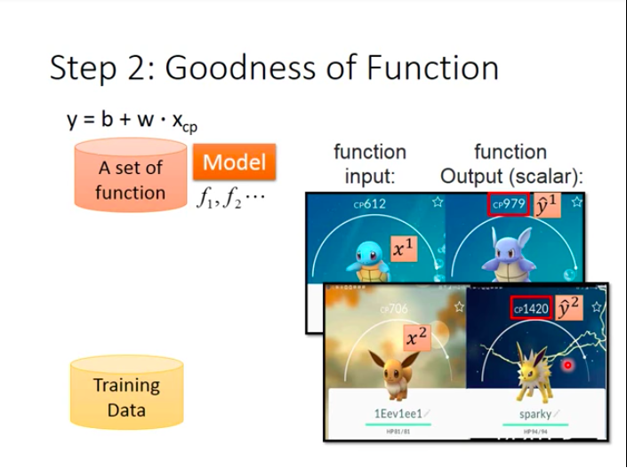
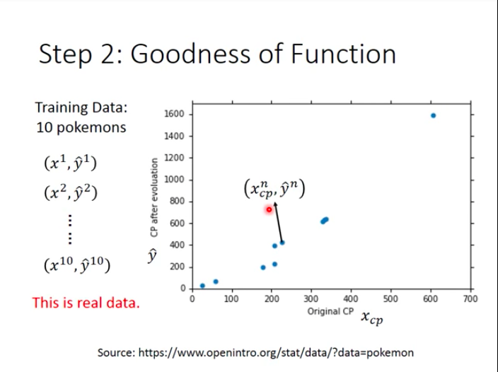
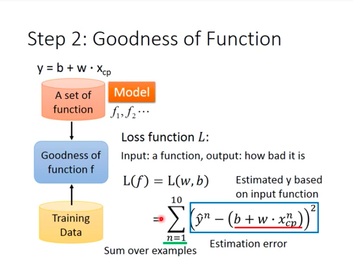
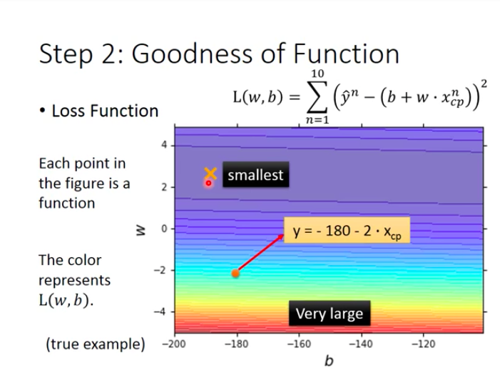
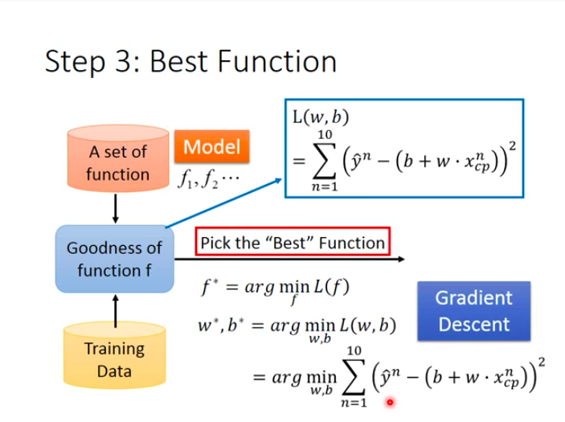
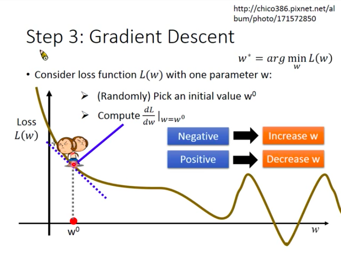

# ML Lecture 1: Regression - Case Study

- Application Examples of Regression

In Reality: stock market forecast, self-driving car and recommendation.

In Pokemon: estimating the Combat Power (CP) of a Pokemon after evolution.

# Steps to do Regression

# Step 1: Model

Define a model (a set of function) that maps x to y, different parameters make different functions, and we need training data to tell us the right parameter values.

- Linear Model

As long as relationship between y and x can be written as:
$$y=b+\Sigma w_ix_i$$
Here, $x_i$ is an attribute of input x (also known as **feature**). $w_i$ called **weight** and $b$ called **bias**. Then, we call this kind of model **linear model**.

# Step 2: Goodness of Function

In task of predicting Pokemon CP, we need to collect lots of data consisting of CP before and after Pokemon evolve.

$x^1$ stands for CP before evolution/original CP  ('1' as superscript stands for a single example marked as 1). $\hat{y}^1$ stands for CP after evolution (hat "^" means this is a real value for the input). 

Assume we have 10 training examples:

Every blue point in the coordinate represents a example.

## Loss Function L

Loss funtion is a "function of function". Its input is a function while its output is how bad the given function is.

$$L(f)=L(w,b)=\Sigma^{10}_{n=1}(\hat{y}^n-(b+w*x^n_{cp}))^2$$

While function f is defined by paramater *b* and *w*, so loss function is actually measuring how bad a set of parameter(w&b) is. And intuitively, the loss function in the slide is summing the difference between estimated y and real y($\hat{y}$) over all 10 examples.

- What does loss function look like?

Every point in the coordinate stands for a function/a set of parameter, and the color in the background stands for value of loss function (from purple to red, the value of loss function rises). As we can see from the coordinate, loss function with smallest value locates at purple region, and that point is the best function that we should pick!

## Step 3: Best Function

This step is to **pick the "Best" function $f^*$ that can minimize loss function**.

$$f^*=arg \min \limits_f\ L(f)$$
$$w^*,b^*=arg \min \limits_{w,b}\ L(w,b)=arg \min \limits_{w,b}\Sigma^{10}_{n=1}(\hat{y}^n-(b+w*s^n_{cp}))^2$$

- How to solve above equation so that we can pick the best function?

A: **Gradient Descent**!

### Gradient Descent

As is stated above, we need to find $w^*$ and $b^*$ that can minimize loss function, and a obvious way to do this is to exhaust all possible value for *w* and *b*, and then calculate loss function's value. But since it's obviously not practical since there are countless possible values for *w* and *b*. So we turn to **gradient descent (GD)**.

- How do GD work?

- Randomly choose a point $w_0$ for w;
- compute $\frac{dL}{dw}|_w=w^0$ (tangent slope for the corresponding point on loss function);
- choose the direction that will make value of loss function to decrease and "move a bit".

